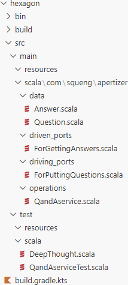
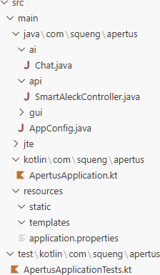



## Apertus

[Public AI](https://publicai.co/) and [Spring AI](https://spring.io/projects/spring-ai) make it easy to access [Apertus](https://www.swiss-ai.org/apertus).

To follow along, you need to be familiar with Spring (Boot) in general and Spring AI in particular. If that is not the case yet, check out [Spring in Action](https://www.manning.com/books/spring-in-action-sixth-edition) (or [Spring Boot 3](https://dpunkt.de/produkt/spring-boot-3/)) and [Spring AI in Action](https://www.manning.com/books/spring-ai-in-action), respectively. But if you already know how to [create projects](#create-project) [securely](#security-as-a-forethought) and [cleanly](#create-subproject), you can skip ahead to [the AI section](#configure-spring-ai).

### Create Project

There are various ways to create a Spring Boot project. My preferred way is to use the [Spring Initializr](https://start.spring.io/):


(At the time of this writing, Kotlin does not support Java 25 and Spring AI does not support Spring Boot 4 yet, which is why Java 21 and Spring Boot 3 are selected instead.)

Even though Spring AI does not explicitly support Apertus and/or Public AI, we do not have to extend Spring's [AI Model API](https://docs.spring.io/spring-ai/reference/api/index.html#_ai_model_api) as [Wells points out in the *OpenAI compatibility* box on page 13](https://www.manning.com/books/spring-ai-in-action):

> *"Although most AI service providers have their own proprietary APIs, many offer OpenAI-compatible APIs either as their own API or as an alternative to their API. AI service providers such as Groq (https://groq.com/) and Google Gemini, tools such as vLLM (https://docs.vllm.ai/) and LiteLLM (https://www.litellm.ai/), and even Ollama offer APIs that are mostly compatible with OpenAI’s API. You can use Spring AI’s OpenAI starter to integrate with these APIs in the same way you would with OpenAI itself."*


Before Java 21, I would have included Spring Reactive Web instead of Spring Web. But now that both Java and Spring support [Virtual Threads](https://dev.java/learn/new-features/virtual-threads/) and since [Spring's asynchronous model](https://docs.spring.io/spring-framework/reference/web-reactive.html) based on [Project Reactor](https://projectreactor.io/) was never pleasant to work with (unlike [Play's asynchronous model](https://www.playframework.com/documentation/latest/ScalaAsync) based on [Scala Futures](https://docs.scala-lang.org/overviews/core/futures.html)), I am more than happy to switch back to Spring Web, but Virtual Threads must be enabled explicitly by adding the following line to `src/main/resources/application.properties`:

```
spring.threads.virtual.enabled=true
```

### Create Subproject

In order to protect the business logic / domain from the harsh world around it (the Web framework, the DBMS, etc.), I am applying the [Ports & Adapters](https://alistaircockburn.company.site/Epub-Hexagonal-Architecture-Explained-Updated-1st-ed-p751233517) pattern. I could do so within the main project, but I prefer to take advantage of Gradle's support for [multi-project builds](https://docs.gradle.org/current/userguide/multi_project_builds.html) so that Gradle can help enforcing the boundary.

Furthermore, I want to implement the business logic / domain in Scala, which Gradle supports through its [Scala plugin](https://docs.gradle.org/current/userguide/scala_plugin.html).

Prepare the folders:

- within the project folder, alongside the existing `src` folder, create a folder `hexagon`
- within folder `hexagon`, create another `src` folder 
- within folder `hexagon/src`, create folders `main` and `test`
- within folder `hexagon/src/main`, create folders `resources` and `scala`
- within folder `hexagon/src/test`, create folder `scala`

Prepare the configuration:

- within the existing `build.gradle.kts` file, add the subproject as well as the [Scala library](https://mvnrepository.com/artifact/org.scala-lang/scala3-library) as dependencies:

```
extra["scalaVersion"] = "3.3.7"
extra["springAiVersion"] = "1.1.2"

dependencies {
    implementation(project(":hexagon"))
    implementation("org.scala-lang:scala3-library_3:${property("scalaVersion")}")

    implementation("org.springframework.boot:spring-boot-starter-actuator")
```

- within the existing `settings.gradle.kts` file, add the subproject as well:

```
rootProject.name = "apertus"
include("hexagon")
```

- within folder `hexagon`, create another file `build.gradle.kts` with the following content:

```
plugins
{
    id("scala")
}

repositories {
    mavenCentral()
}

scala {
    scalaVersion = "3.3.7"
}
```

In my experience, applying the Ports & Adapters pattern is not an option but a necessity. It is not even a trade-off, as it still allows for adopting a [Clean](https://blog.cleancoder.com/uncle-bob/2012/08/13/the-clean-architecture.html) or [Onion](https://jeffreypalermo.com/tag/onion-architecture/) architecture when desired. And while I appreciate the *concepts* of [Domain-Driven Design](https://leanpub.com/ddd-by-example) (DDD) as much as the next guy, I [do not follow them mechanically, let alone slavishly](https://www.heise.de/blog/Wendet-man-DDD-auf-DDD-an-bleibt-kein-Domain-Driven-Design-uebrig-11102739.html). I do not even limit myself to [OOP modeling](https://docs.scala-lang.org/scala3/book/taste-modeling.html#oop-domain-modeling); I find it perfectly fine to adopt [FP modeling](https://docs.scala-lang.org/scala3/book/domain-modeling-fp.html) and, for example, represent entities (which are conceptually mutable) by [case classes](https://docs.scala-lang.org/scala3/book/domain-modeling-tools.html#case-classes)/[data classes](https://kotlinlang.org/docs/data-classes.html)/[records](https://dev.java/learn/records/) within a request-response cycle.


source: [*Domain Modeling Made Functional*](https://pragprog.com/titles/swdddf/domain-modeling-made-functional/)

### Security as a Forethought

Applying the Ports & Adapters pattern and enabling Spring Security in a teaching aid might seem like overkill. But you should bear with me. Too many textbook examples with concious shortcuts end up in prototypes which in turn end up in production. Eventually, some poor schmuck (quite possibly your future self) will have to [clean the mess up](https://codeartify.substack.com/p/effectively-separating-concerns-in-legacy-code).

Just enabling Spring Security (simply by having included it above) without customizing it is fine at this stage. Being forced to sign in with either the temporary user created at start-up time or ... is a constant reminder

### Configure Spring AI

The switch from Open AI to Public AI with one of the two Apertus models is made by adding the following lines to `src/main/resources/application.properties`:

```
spring.ai.openai.api-key=${PUBLIC_AI_API_KEY}
# spring.ai.openai.api-key for DEV is set in $HOME\.config\spring-boot-devtools.properties
spring.ai.openai.base-url=https://api.publicai.co
# spring.ai.openai.chat.base-url=https://api.publicai.co
spring.ai.openai.chat.options.model=swiss-ai/apertus-8b-instruct
# spring.ai.openai.chat.options.model=swiss-ai/apertus-70b-instruct
```

The [production API key]((https://platform.publicai.co/settings/api-keys)) will have to be configured through an environment variable. But since the [developer tools](https://docs.spring.io/spring-boot/reference/using/devtools.html#using.devtools.globalsettings) have been included above, the [development API key]((https://platform.publicai.co/settings/api-keys)) can be added to [$HOME/.config/spring-boot.spring-boot-devtools.properties](https://docs.spring.io/spring-boot/reference/using/devtools.html#using.devtools.globalsettings) and is picked up in [the usual order](https://docs.spring.io/spring-boot/reference/features/external-config.html).

As trivial as it may seem now, [Wells' tip in the *Inspecting Spring AI requests and responses* box on page 41](https://www.manning.com/books/spring-ai-in-action) helped me figure out that prefixing the model with `swiss-ai/` is the way to go (whereas setting the `spring.ai.model.chat` property to `swiss-ai` is not as that would cause Spring AI to look for a [ChatModel](https://docs.spring.io/spring-ai/reference/api/chatmodel.html) implementation that does not [exist](https://docs.spring.io/spring-ai/reference/api/chat/comparison.html)).


### Code

#### Business Logic / Domain



```scala
package com.squeng.apertus.data

final case class Answer(a: String)
```

```scala
package com.squeng.apertus.data

final case class Question(q: String)
```

```scala
package com.squeng.apertus.driven_ports

import com.squeng.apertus.data.Answer
import com.squeng.apertus.data.Question

trait KnowItAll:
  def ask(question: Question): Answer
```

```scala
package com.squeng.apertus.driving_ports

import com.squeng.apertus.data.Answer
import com.squeng.apertus.data.Question

trait SmartAleck:
  def ask(question: Question): Answer
```

```scala
package com.squeng.apertus.operations

import com.squeng.apertus.data.Answer
import com.squeng.apertus.data.Question
import com.squeng.apertus.driven_ports.KnowItAll
import com.squeng.apertus.driving_ports.SmartAleck

class SmartAleckService(knowItAll: KnowItAll) extends SmartAleck:

  override def ask(question: Question): Answer =
    knowItAll.ask(question)
```

#### Spring



```java
package com.squeng.apertus.ai;

import org.springframework.ai.chat.client.ChatClient;
import org.springframework.stereotype.Component;
import org.springframework.web.bind.annotation.GetMapping;

import com.squeng.apertus.data.Answer;
import com.squeng.apertus.data.Question;
import com.squeng.apertus.driven_ports.KnowItAll;

@Component
public class Chat implements KnowItAll {

    private final ChatClient chatClient;

    public Chat(ChatClient.Builder chatClientBuilder) {
        this.chatClient = chatClientBuilder.build();
    }

    @Override
    public Answer ask(Question question) {
        return Answer.apply(chatClient.prompt()
                .user(question.q())
                .call()
                .content());
    }
}
```

```java
package com.squeng.apertus.api;

import org.springframework.web.bind.annotation.GetMapping;
import org.springframework.web.bind.annotation.RequestMapping;
import org.springframework.web.bind.annotation.RequestParam;
import org.springframework.web.bind.annotation.RestController;

import com.squeng.apertus.data.Question;
import com.squeng.apertus.driving_ports.SmartAleck;

@RestController
@RequestMapping("/api/sa")
public class SmartAleckController {

    private final SmartAleck smartAleck;

    public SmartAleckController(SmartAleck smartAleck) {
        this.smartAleck = smartAleck;
    }

    @GetMapping(produces = "text/plain")
    public String ask(@RequestParam String q) {
        return smartAleck.ask(Question.apply(q)).a();
    }
}
```

```java
package com.squeng.apertus;

import org.springframework.context.annotation.Bean;
import org.springframework.context.annotation.Configuration;

import com.squeng.apertus.driven_ports.KnowItAll;
import com.squeng.apertus.driving_ports.SmartAleck;
import com.squeng.apertus.operations.SmartAleckService;

@Configuration
public class AppConfig {

    private final KnowItAll knowItAll;

    public AppConfig(KnowItAll knowItAll) {
        this.knowItAll = knowItAll;
    }

    @Bean
    public SmartAleck smartAleck() {
        return new SmartAleckService(knowItAll);
    }
}
```

### Profiles

[...](https://docs.spring.io/spring-boot/reference/features/external-config.html#features.external-config.files.profile-specific)

### Actuator

...

### JTE

...
