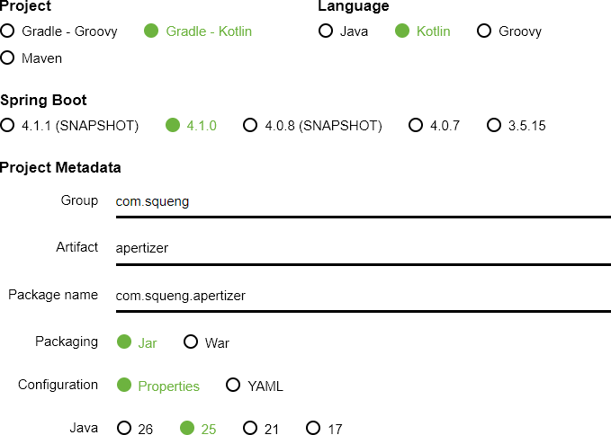
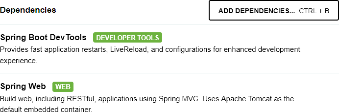
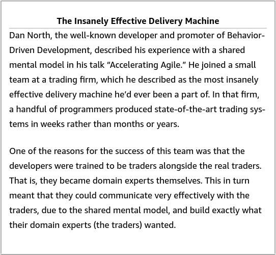
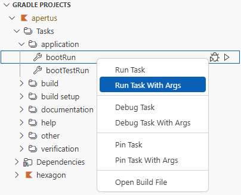
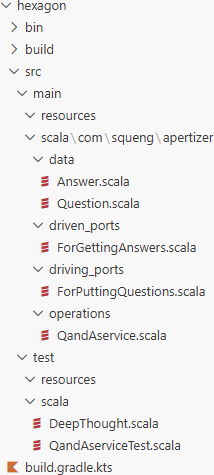
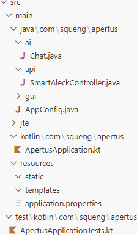



## Apertizer

Via [Public AI](https://publicai.co/), [Spring AI](https://spring.io/projects/spring-ai) can use [Apertus](https://www.swiss-ai.org/apertus) with little effort. This guide shows how.

To follow along, you need to be familiar with [Spring](https://spring.io/) ([Boot](https://spring.io/projects/spring-boot)) in general and Spring AI in particular. If that is not the case yet, check out [*Spring in Action*](https://www.manning.com/books/spring-in-action-sixth-edition) and [*Spring AI in Action*](https://www.manning.com/books/spring-ai-in-action), respectively.

If you already know how to [create projects](#create-project) [cleanly](#create-subproject) and how to configure them properly, you can skip ahead to [the AI section](#spring-ai-configuration).

### Create Project

There are various ways to create a Spring Boot project. My preferred way is to use the [Spring Initializr](https://start.spring.io/):



(At the time of this writing, Kotlin does not support Java 25 yet, which is why Java 21 is selected instead.)

Even though Spring AI does not explicitly support Apertus and/or Public AI, we do not have to extend Spring's [AI Model API](https://docs.spring.io/spring-ai/reference/api/index.html#_ai_model_api) as [Wells points out in the *OpenAI compatibility* box on page 13](https://www.manning.com/books/spring-ai-in-action):

> *"Although most AI service providers have their own proprietary APIs, many offer OpenAI-compatible APIs either as their own API or as an alternative to their API. AI service providers such as Groq (https://groq.com/) and Google Gemini, tools such as vLLM (https://docs.vllm.ai/) and LiteLLM (https://www.litellm.ai/), and even Ollama offer APIs that are mostly compatible with OpenAI’s API. You can use Spring AI’s OpenAI starter to integrate with these APIs in the same way you would with OpenAI itself."*



Before Java 21, I would have included Spring Reactive Web instead of Spring Web. But now that both Java and Spring support [Virtual Threads](https://dev.java/learn/new-features/virtual-threads/) and since [Spring's asynchronous model](https://docs.spring.io/spring-framework/reference/web-reactive.html) based on [Project Reactor](https://projectreactor.io/) was never pleasant to work with (unlike [Play's asynchronous model](https://www.playframework.com/documentation/latest/ScalaAsync) based on [Scala Futures](https://docs.scala-lang.org/overviews/core/futures.html)), I am more than happy to switch back to Spring Web, but Virtual Threads must be enabled explicitly by adding the following line to `src/main/resources/application.properties`:

```
spring.threads.virtual.enabled=true
```

#### Create Subproject

In order to protect the business logic / domain from the "harsh world" around it (the Web framework, the DBMS, etc.), I am applying the [Ports & Adapters](https://alistaircockburn.company.site/Epub-Hexagonal-Architecture-Explained-Updated-1st-ed-p751233517) pattern. I could do so within the main project (e.g., enforced by [ArchUnit](https://www.archunit.org/) as explained in [*Get Your Hands Dirty on Clean Architecture*](https://leanpub.com/get-your-hands-dirty-on-clean-architecture) or by [Spring Modulith](https://spring.io/projects/spring-modulith)), but I prefer to take advantage of Gradle's support for [multi-project builds](https://docs.gradle.org/current/userguide/multi_project_builds.html) so that Gradle can help enforcing the boundary.

In my experience, applying the Ports & Adapters pattern is less of an option and more of a necessity. It is not even a trade-off as it still allows for adopting a [Clean](https://blog.cleancoder.com/uncle-bob/2012/08/13/the-clean-architecture.html) or [Onion](https://jeffreypalermo.com/tag/onion-architecture/) architecture when desired. And while I appreciate the *concepts* of [Domain-Driven Design](https://leanpub.com/ddd-by-example) (DDD) as much as the next guy, I [do not follow them mechanically, let alone slavishly](https://www.heise.de/blog/Wendet-man-DDD-auf-DDD-an-bleibt-kein-Domain-Driven-Design-uebrig-11102739.html). I do not even limit myself to [OOP modeling](https://docs.scala-lang.org/scala3/book/taste-modeling.html#oop-domain-modeling); I find it perfectly fine to adopt [data-oriented programming](https://www.manning.com/books/data-oriented-programming-in-java) / [FP modeling](https://docs.scala-lang.org/scala3/book/domain-modeling-fp.html) and, for example, even go so far as to represent entities (which are conceptually mutable) by [case classes](https://docs.scala-lang.org/scala3/book/domain-modeling-tools.html#case-classes) / [data classes](https://kotlinlang.org/docs/data-classes.html) / [records](https://dev.java/learn/records/) within a request-response cycle.



source: [*Domain Modeling Made Functional*](https://pragprog.com/titles/swdddf/domain-modeling-made-functional/)

Furthermore, I want to implement the business logic / domain in Scala, which Gradle supports through its [Scala plugin](https://docs.gradle.org/current/userguide/scala_plugin.html).

Prepare the folders:

- within the project folder, alongside the existing `src` folder, create a folder `hexagon`
- within folder `hexagon`, create another `src` folder 
- within folder `hexagon/src`, create folders `main` and `test`
- within both folder `hexagon/src/main` and folder `hexagon/src/test`, create folders `resources` and `scala`

Prepare the configuration:

- within the existing `build.gradle.kts` file, add the subproject as well as the [Scala library](https://mvnrepository.com/artifact/org.scala-lang/scala3-library) as dependencies:

```
extra["scalaVersion"] = "3.3.7"
extra["springAiVersion"] = "2.0.0-M2"

dependencies {
    implementation(project(":hexagon"))
    implementation("org.scala-lang:scala3-library_3:${property("scalaVersion")}")

    implementation("org.springframework.boot:spring-boot-starter-actuator")
```

- within the existing `settings.gradle.kts` file, add the subproject as well:

```
rootProject.name = "apertizer"
include("hexagon")
```

- within folder `hexagon`, create another file `build.gradle.kts` with the following content:

```
plugins {
    id("scala")
}

repositories {
    mavenCentral()
}

scala {
    scalaVersion = "3.3.7"
}

dependencies {
    implementation("jakarta.annotation:jakarta.annotation-api:3.0.0")
    testImplementation("org.scalameta:munit_3:1.2.2")
}
```
Note the dependency on [Jakarta Annotations](https://jakarta.ee/specifications/annotations/). Annotations such as [`RolesAllowed`](https://jakarta.ee/specifications/annotations/3.0/annotations-spec-3.0#jakarta-annotation-security-rolesallowed) allow for framework-independent access-control declarations. Note further that Spring Boot needs to be configured *not* to ignore them (see `AppConfigSec` below).

At this point, however, one does not have worry about Spring yet. While this guide continues with [preparing profiles](#profiles) and [configuring Spring](#general-spring-configuration), one could focus on the [business logic / domain](#business-logic--domain) first. The subproject has everything one needs to implement and test the business logic / domain.

Speaking of testing, [MUnit](https://scalameta.org/munit/) has been chosen as the testing library because it is part of the [Scala Toolkit](https://docs.scala-lang.org/toolkit/introduction.html). (There are viable alternatives [to the Scala Toolkit](https://github.com/com-lihaoyi) in general and [to MUnit](https://scalameta.org/munit/docs/getting-started.html#inspirations) in particular.) More importantly, adhering to the Ports & Adapters pattern makes testing the business logic / domain much easier; no [mocks/stubs/…](https://www.martinfowler.com/articles/mocksArentStubs.html#TheDifferenceBetweenMocksAndStubs) library is required to create [test doubles](https://www.manning.com/books/effective-software-testing).

### Profiles

[Profiles](https://docs.spring.io/spring-boot/reference/features/profiles.html) (think DEV, TEST, etc.) are supported out of the box and allow for both [profile-specific configuration files](https://docs.spring.io/spring-boot/reference/features/external-config.html#features.external-config.files.profile-specific) and [configuration classes](https://docs.spring.io/spring-boot/reference/using/configuration-classes.html). In what follows, we are making use of both. As a preparation, create a file `application-dev.properties` within the project folder, alongside the existing `application.properties` file.

Note that [*"Profiles are not supported in devtools properties/yaml files."*](https://docs.spring.io/spring-boot/reference/using/devtools.html#using.devtools.globalsettings). Therefore, we have to [run our application passing arguments](https://docs.spring.io/spring-boot/gradle-plugin/running.html#running-your-application.passing-arguments) through the Gradle extension …



… and VSC …


… or through the command line: `C:\Users\Paul\Desktop\Apertizer> ./gradlew bootRun --args='--spring.profiles.active=dev'` (Note further that even though the [developer tools](https://docs.spring.io/spring-boot/reference/using/devtools.html#using.devtools.globalsettings) have been included above, I first have to tell Gradle to re-[build continuously](https://docs.gradle.org/current/userguide/incremental_build.html#sec:task_input_output_continuous_build) when any classes have been changed: `C:\Users\Paul\Desktop\Apertizer> ./gradlew -t classes`)

### General Spring Configuration

#### Security as a Forethought

Applying the Ports & Adapters pattern and enabling Spring Security in a teaching aid might seem like overkill. But you should bear with me. Too many textbook examples with concious shortcuts end up in prototypes which in turn end up in production. Eventually, some poor schmuck (quite possibly your future self) will have to [clean the mess up](https://codeartify.substack.com/p/effectively-separating-concerns-in-legacy-code).

Just enabling Spring Security (simply by having included it above) without configuring it would be fine at this stage. Being forced to sign in with the temporary user created at start-up time would be a constant reminder to properly configure security and would also be a safety net should the app be deployed prematurely. And since the [developer tools](https://docs.spring.io/spring-boot/reference/using/devtools.html#using.devtools.globalsettings) have been included above, a convenience user could be added to [`$HOME/.config/spring-boot.spring-boot-devtools.properties`](https://docs.spring.io/spring-boot/reference/using/devtools.html#using.devtools.globalsettings) in the meantime:

```
spring.security.user.name=yours_truly
spring.security.user.password=insecure_password
spring.security.user.roles=MISCAST
```

Nevertheless, we can do better from the start by adding the following [configuration file/class](https://docs.spring.io/spring-boot/reference/using/configuration-classes.html) to folder/package `src/main/java/com/squeng/apertizer`:
```java
package com.squeng.apertizer;

import org.springframework.context.annotation.Bean;
import org.springframework.context.annotation.Configuration;
import org.springframework.security.config.annotation.method.configuration.EnableMethodSecurity;
import org.springframework.security.config.annotation.web.builders.HttpSecurity;
import org.springframework.security.config.annotation.web.configuration.EnableWebSecurity;
import org.springframework.security.web.SecurityFilterChain;

@Configuration
@EnableMethodSecurity(jsr250Enabled = true)
@EnableWebSecurity
public class AppConfigSec {

        @Bean
        public SecurityFilterChain filterChain(HttpSecurity http) throws Exception {
                http.authorizeHttpRequests(authorize -> authorize
                                .requestMatchers("/actuator/**", "/api/poorMansActuator/**")
                                .hasRole("ADMIN")
                                .requestMatchers("/apertus/**")
                                .hasRole("USER")
                                .requestMatchers("/", "/apple-touch-icon.png", "/favicon.ico", "/favicon.svg", "/*.css")
                                .permitAll()
                                .anyRequest()
                                .authenticated())
                                .headers(headers -> headers.contentSecurityPolicy(csp -> csp
                                                .policyDirectives(String.join("; ",
                                                                "default-src 'none'",
                                                                "connect-src 'self'",
                                                                "font-src 'self' https://cdn.jsdelivr.net/npm/bootstrap-icons@1.13.1/",
                                                                "img-src 'self' data:",
                                                                "script-src 'self' https://cdn.jsdelivr.net/npm/bootstrap@5.3.8/ https://cdn.jsdelivr.net/npm/htmx.org@2.0.8/",
                                                                "style-src 'self' 'unsafe-hashes' 'sha256-faU7yAF8NxuMTNEwVmBz+VcYeIoBQ2EMHW3WaVxCvnk=' https://cdn.jsdelivr.net/npm/bootstrap@5.3.8/ https://cdn.jsdelivr.net/npm/bootstrap-icons@1.13.1/",
                                                                "frame-ancestors 'none'"))))
                                .sessionManagement(session -> session
                                                .sessionFixation().newSession())
                                .formLogin(signIn -> signIn
                                                .loginPage("/signIn")
                                                .loginProcessingUrl("/signIn")
                                                .defaultSuccessUrl("/")
                                                .permitAll())
                                .logout(signOut -> signOut
                                                .logoutUrl("/signOut")
                                                .logoutSuccessUrl("/signIn?signedOut")
                                                .invalidateHttpSession(true)
                                                .permitAll());
                return http.build();
        }
}
```

(The three images in line `.requestMatchers("/", "/apple-touch-icon.png", "/favicon.ico", "/favicon.svg", "/*.css")` have been created with [RealFaviconGenerator](https://realfavicongenerator.net/) and added to `src/main/resources/static`.)

Since [*"Spring Boot Starter Security does not activate method-level authorization by default"*](https://docs.spring.io/spring-security/reference/servlet/authorization/method-security.html), we activate it with `@EnableMethodSecurity`. However, if we are serious about keeping the business logic / domain independent of Spring, we must not annotate its methods with Spring-specific annotations, which is why we [allow for using JSR-250 annotations](https://docs.spring.io/spring-security/reference/servlet/authorization/method-security.html#use-jsr250).

There is no need to decide against request-level authorization when deciding for method-level authorization. We can use the best of [both worlds](https://docs.spring.io/spring-security/reference/servlet/authorization/method-security.html#request-vs-method).

By the way, while it is tempting to [hiearchically order roles](https://docs.spring.io/spring-security/reference/servlet/authorization/architecture.html#authz-hierarchical-roles) `ADMIN` and `USER` …

```java
        @Bean
        public RoleHierarchy roleHierarchy() {
                return RoleHierarchyImpl.fromHierarchy("ROLE_ADMIN > ROLE_USER");
        }
```

… you should conciously (have to) sign in as either an admin or a user when you access your production system.

As is to be expected, the [default security headers](https://docs.spring.io/spring-security/reference/features/exploits/headers.html#headers-default) are a good start. Adding a restrictive [Content Security Policy](https://cheatsheetseries.owasp.org/cheatsheets/Content_Security_Policy_Cheat_Sheet.html) is even better. And remember to regularly check your app with [Mozilla's HTTP Observatory](https://developer.mozilla.org/en-US/observatory).

#### Actuator

Even though [Actuator](https://docs.spring.io/spring-boot/reference/actuator/index.html) provides features for managing and monitoring apps during production, we can take advantage of it as early as during development.

Since the [developer tools](https://docs.spring.io/spring-boot/reference/using/devtools.html#using.devtools.globalsettings) have been included above, (additional) endpoints can be enabled in [`$HOME/.config/spring-boot.spring-boot-devtools.properties`](https://docs.spring.io/spring-boot/reference/using/devtools.html#using.devtools.globalsettings). For example, by enabling the `env` endpoint, we can not only visit `http://localhost:8080/actuator` and `http://localhost:8080/actuator/health` but also `http://localhost:8080/actuator/env`: `management.endpoints.web.exposure.include=env,health`

#### JTE

Disable [development mode](https://jte.gg/spring-boot-starter-3/#development) in `application.properties` by setting `gg.jte.development-mode` to `false`, but add `gg.jte.development-mode=true` to `application-dev.properties`. Furthermore, [precompile the templates for production](https://jte.gg/spring-boot-starter-3/#production) by adding `gg.jte.usePrecompiledTemplates=true` to `application.properties`, but add `gg.jte.usePrecompiledTemplates=false` to `application-dev.properties`.

##### i18n / l10n

Spring Boot and JTE support [Internationalization](https://docs.spring.io/spring-boot/reference/features/internationalization.html) (i18n) and [localization](https://jte.gg/localization/) out of the box, but need some minor bridging.

First, however, let us prepare the l10n files:

- within folder `src/main/resources`, create a folder `lang`
- within folder `lang`, create file `messages.properties` for the default language and further files for further languages (e.g., `messages_de.propertes` for German)

The following `JteLocalizer` class is the bridge between Spring Boot's `MessageSource` and JTE's `LocalizationSupport`:

```java
package com.squeng.apertizer.gui;

import org.springframework.context.MessageSource;
import org.springframework.context.i18n.LocaleContextHolder;

import gg.jte.support.LocalizationSupport;

public class JteLocalizer implements LocalizationSupport {

    private final MessageSource messageSource;

    public JteLocalizer(MessageSource messageSource) {
        this.messageSource = messageSource;
    }

    @Override
    public String lookup(String key) {
        return messageSource.getMessage(key, null, LocaleContextHolder.getLocale());
    }
}
```

To make an instance available to all JTE templates without having to add it to the UI model in every controller method, we can add it to the UI model through a `ControllerAdvice`:

```java
package com.squeng.apertizer.gui;

import org.springframework.security.web.csrf.CsrfToken;
import org.springframework.ui.Model;
import org.springframework.web.bind.annotation.ControllerAdvice;
import org.springframework.web.bind.annotation.ModelAttribute;

@ControllerAdvice(basePackages = "com.squeng.apertizer.gui")
public class JteControllerAdvice {

    private final JteLocalizer jteLocalizer;

    public JteControllerAdvice(JteLocalizer jteLocalizer) {
        this.jteLocalizer = jteLocalizer;
    }

    @ModelAttribute
    public void csrf(Model model, CsrfToken token) {
        model.addAttribute("csrfToken", token);
    }

    @ModelAttribute
    public void l10n(Model model) {
        model.addAttribute("localizer", jteLocalizer);
    }
}
```

…

### Spring AI Configuration

The switch from Open AI to Public AI with one of the two Apertus models is made by adding the following lines to `src/main/resources/application.properties`:

```
spring.ai.openai.api-key=${PUBLIC_AI_API_KEY}
# spring.ai.openai.api-key for DEV is set in $HOME\.config\spring-boot-devtools.properties
spring.ai.openai.base-url=https://api.publicai.co
# spring.ai.openai.chat.base-url=https://api.publicai.co
spring.ai.openai.chat.options.model=swiss-ai/apertus-8b-instruct
# spring.ai.openai.chat.options.model=swiss-ai/apertus-70b-instruct
```

The [production API key]((https://platform.publicai.co/settings/api-keys)) will have to be configured through an environment variable. But since the [developer tools](https://docs.spring.io/spring-boot/reference/using/devtools.html#using.devtools.globalsettings) have been included above, the [development API key]((https://platform.publicai.co/settings/api-keys)) can be added to [`$HOME/.config/spring-boot.spring-boot-devtools.properties`](https://docs.spring.io/spring-boot/reference/using/devtools.html#using.devtools.globalsettings) and is picked up in [the usual order](https://docs.spring.io/spring-boot/reference/features/external-config.html).

As trivial as it may seem now, [Wells' tip in the *Inspecting Spring AI requests and responses* box on page 41](https://www.manning.com/books/spring-ai-in-action) helped me figure out that prefixing the model with `swiss-ai/` is the way to go (whereas setting the `spring.ai.model.chat` property to `swiss-ai` is not as that would cause Spring AI to look for a [ChatModel](https://docs.spring.io/spring-ai/reference/api/chatmodel.html) implementation that does not [exist](https://docs.spring.io/spring-ai/reference/api/chat/comparison.html)):

> *"If you’d like to see what the raw request and response JSON looks like when submitting prompts with Spring AI, then you’ll want to add Logbook (https://github.com/zalando/logbook) to your project’s build"*

- Within the top-level `build.gradle.kts` file, add `implementation("org.zalando:logbook-spring-boot-starter:4.0.0-RC.1")` to the `dependencies`.
- With a dev profile (see above), add the following lines to `src/main/resources/application-dev.properties` …

```
logging.level.org.zalando.logbook=TRACE
logbook.format.style = http
```

- … and the following [configuration file/class](https://docs.spring.io/spring-boot/reference/using/configuration-classes.html) to folder/package `src/main/java/com/squeng/apertizer`:

```java
package com.squeng.apertizer;

import org.springframework.boot.restclient.RestClientCustomizer;
import org.springframework.context.annotation.Bean;
import org.springframework.context.annotation.Configuration;
import org.springframework.context.annotation.Profile;
import org.zalando.logbook.spring.LogbookClientHttpRequestInterceptor;

@Configuration
@Profile("dev")
public class AppConfigDev {

    @Bean
    // cf. Spring AI in Action, page 41
    public RestClientCustomizer logbookCustomizer(LogbookClientHttpRequestInterceptor interceptor) {
        return restClient -> restClient.requestInterceptor(interceptor);
    }
}
```

From here on, you could try the [many third-party examples](https://github.com/spring-ai-community/awesome-spring-ai#code--examples) out with Apertus …

### Code

… or continue with my example.

#### Business Logic / Domain

Again, this section could have immediately followed [creating the subproject](#create-subproject) even though this guide follows the latter with [preparing profiles](#profiles) and [configuring Spring](#general-spring-configuration).



The example domain is conciously kept simple and rather reflects [FP domain modeling](https://docs.scala-lang.org/scala3/book/taste-modeling.html#fp-domain-modeling) than [OOP domain modeling](https://docs.scala-lang.org/scala3/book/taste-modeling.html#oop-domain-modeling) in general and [DDD](https://www.domainlanguage.com/ddd/) in particular.

```scala
package com.squeng.apertizer.data

final case class Answer(a: String)
```

```scala
package com.squeng.apertizer.data

final case class Question(q: String)
```

The ports demarcate the border of the hexagon, with the driving port(s) being implemented within the hexagon and the driven port(s) outwith.

```scala
package com.squeng.apertizer.driven_ports

import com.squeng.apertizer.data.Answer
import com.squeng.apertizer.data.Question

trait ForGettingAnswers:
  def ask(question: Question): Answer
```

```scala
package com.squeng.apertizer.driving_ports

import com.squeng.apertizer.data.Answer
import com.squeng.apertizer.data.Question

trait ForPuttingQuestions:
  def ask(question: Question): Answer
```

```scala
package com.squeng.apertizer.operations

import jakarta.annotation.security.RolesAllowed

import com.squeng.apertizer.data.Answer
import com.squeng.apertizer.data.Question
import com.squeng.apertizer.driven_ports.ForGettingAnswers
import com.squeng.apertizer.driving_ports.ForPuttingQuestions

class QandAservice(oracle: ForGettingAnswers) extends ForPuttingQuestions:
  require(oracle != null, "🐛")

  @RolesAllowed(Array("USER"))
  override def ask(question: Question): Answer =
    oracle.ask(question)
```

For testing puroposes, however, we also provide an implementation of the driven port within the hexagon …

```scala
package com.squeng.apertizer.driven_ports

import com.squeng.apertizer.data.Answer

import com.squeng.apertizer.data.Question

object DeepThought extends ForGettingAnswers:
  override def ask(question: Question): Answer = Answer(42.toString)
```

… and simply inject it "by hand".

```scala
package com.squeng.apertizer.operations

import com.squeng.apertizer.data.Question
import com.squeng.apertizer.data.Answer
import com.squeng.apertizer.driven_ports.DeepThought
import com.squeng.apertizer.operations.QandAservice
import com.squeng.apertizer.driven_ports.DeepThought

class QandAserviceTest extends munit.FunSuite:
  test("instatiate QandAservice without any driven port") {
    intercept[IllegalArgumentException] {
      val corruptService = QandAservice(null)
    }
  }

  test("have QandAservice defer to a driven port") {
    val answer = QandAservice(DeepThought).ask(Question("🤔"))
    assertEquals(answer, Answer(42.toString))
  }
```

#### Spring



```java
package com.squeng.apertizer.ai;

import org.springframework.ai.chat.client.ChatClient;
import org.springframework.context.annotation.Primary;
import org.springframework.stereotype.Component;
import org.springframework.web.bind.annotation.GetMapping;

import com.squeng.apertizer.data.Answer;
import com.squeng.apertizer.data.Question;
import com.squeng.apertizer.driven_ports.ForGettingAnswers;

@Component
@Primary
public class KnowItAll implements ForGettingAnswers {

    private final ChatClient chatClient;

    public KnowItAll(ChatClient.Builder chatClientBuilder) {
        this.chatClient = chatClientBuilder.build();
    }

    @Override
    public Answer ask(Question question) {
        return Answer.apply(chatClient.prompt()
                .user(question.q())
                .call()
                .content());
    }
}
```

Note how `KnowItAll` is annotated with `@Primary`. During development or testing, we may not always want to actually query Apertus and instead use a dummy implementation of `ForGettingAnswers` such as the following:

```java
package com.squeng.apertizer.dev;

import org.springframework.ai.chat.client.ChatClient;
import org.springframework.stereotype.Component;
import org.springframework.web.bind.annotation.GetMapping;

import com.squeng.apertizer.data.Answer;
import com.squeng.apertizer.data.Question;
import com.squeng.apertizer.driven_ports.ForGettingAnswers;

@Component
public class SmartAleck implements ForGettingAnswers {

    @Override
    public Answer ask(Question question) {
        return Answer.apply("figuring out the answer to this question is left as an exercise for the questioner");
    }
}
```

```java
package com.squeng.apertizer.api;

import org.springframework.web.bind.annotation.GetMapping;
import org.springframework.web.bind.annotation.RequestMapping;
import org.springframework.web.bind.annotation.RequestParam;
import org.springframework.web.bind.annotation.RestController;

import com.squeng.apertizer.data.Question;
import com.squeng.apertizer.driving_ports.ForPuttingQuestions;

@RestController
@RequestMapping("/api/sa")
public class QandAcontroller {

    private final ForPuttingQuestions researcher;

    public QandAcontroller(ForPuttingQuestions researcher) {
        this.researcher = researcher;
    }

    @GetMapping(produces = "text/plain")
    public String ask(@RequestParam String q) {
        return researcher.ask(Question.apply(q)).a();
    }
}
```

In order for the subproject to be truly independent of Spring, we cannot use any Spring annotations within the hexagon and must configure the concrete adapters for the abstract ports outside of the subproject:

```java
package com.squeng.apertizer;

import org.springframework.context.annotation.Bean;
import org.springframework.context.annotation.Configuration;

import com.squeng.apertizer.driven_ports.ForGettingAnswers;
import com.squeng.apertizer.driving_ports.ForPuttingQuestions;
import com.squeng.apertizer.operations.QandAservice;

@Configuration
// the configurator in Ports & Adapters terminology
public class AppConfig {

    private final ForGettingAnswers oracle;

    public AppConfig(ForGettingAnswers oracle) {
        this.oracle = oracle;
    }

    @Bean
    public ForPuttingQuestions fpqService() {
        return new QandAservice(oracle);
    }
}
```

```java
package com.squeng.apertizer;

import java.util.List;

import org.springframework.boot.restclient.RestClientCustomizer;
import org.springframework.context.annotation.Bean;
import org.springframework.context.annotation.Configuration;
import org.springframework.context.annotation.Profile;
import org.springframework.security.access.hierarchicalroles.RoleHierarchy;
import org.springframework.security.access.hierarchicalroles.RoleHierarchyImpl;
import org.springframework.security.core.authority.SimpleGrantedAuthority;
import org.springframework.security.core.userdetails.User;
import org.springframework.security.core.userdetails.UserDetailsService;
import org.springframework.security.crypto.bcrypt.BCryptPasswordEncoder;
import org.springframework.security.crypto.password.PasswordEncoder;
import org.springframework.security.provisioning.InMemoryUserDetailsManager;
import org.zalando.logbook.spring.LogbookClientHttpRequestInterceptor;

@Configuration
@Profile("dev")
public class AppConfigDev {

    @Bean
    // cf. Spring AI in Action, page 41
    public RestClientCustomizer logbookCustomizer(LogbookClientHttpRequestInterceptor interceptor) {
        return restClient -> restClient.requestInterceptor(interceptor);
    }

    @Bean
    public PasswordEncoder passwordEncoder() {
        return new BCryptPasswordEncoder();
    }

    @Bean
    public UserDetailsService userDetailsService(PasswordEncoder encoder) {
        return new InMemoryUserDetailsManager(List.of(
                new User(
                        "theUser", encoder.encode("insecure-password"),
                        List.of(new SimpleGrantedAuthority("ROLE_USER"))),
                new User(
                        "theAdmin", encoder.encode("insecure-password"),
                        List.of(new SimpleGrantedAuthority("ROLE_ADMIN"))),
                new User(
                        "theLazyDev", encoder.encode("insecure-password"),
                        List.of(new SimpleGrantedAuthority("ROLE_LAZYDEV")))));
    }

    @Bean
    public RoleHierarchy roleHierarchy() {
        return RoleHierarchyImpl.withDefaultRolePrefix()
                .role("LAZYDEV").implies("ADMIN", "USER")
                .build();
    }
}
```
