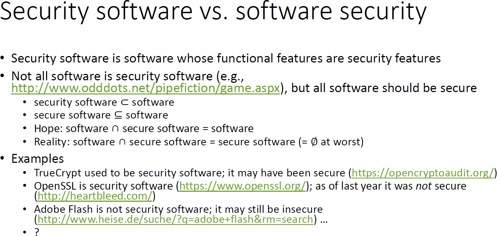



## Vom Nicht-Programmierer zum Software-Ingenieur

Auch in der Software-Entwicklung gilt, dass Übung den Meister macht. Und je nach schulischer Ausbildung und beruflicher Weiterbildung hat man vielleicht das Glück, unter Anleitung von Lehrern, Mentoren etc. eine Stufe nach der anderen zu erklimmen. Doch wie wird man autodidaktisch Software-Ingenieur, wenn man noch Software-Entwickler ist, Software-Entwickler, wenn man noch Programmierer ist, oder Programmierer, wenn man noch Nicht-Programmierer ist? *[Thereʼs a book for that!](https://io.squeng.com/2019/03/17/nicht-nur-lesen-bildet/)*

---

Bezeichnen Programmierer, Software-Entwickler und Software-Ingenieur nicht das gleiche? Nein! In den Worten von [Jacobson *et al.*](https://dl.acm.org/doi/book/10.1145/3277669):

- „*Programming* stands for the work related to implementation or coding of source code.“
- „*Software development* is the larger process which, apart from programming, includes working with requirements, design, test, etc.“
- „«*Software engineering* combines engineering techniques with software development practices» (from Wikipedia). Moving from development to engineering means more reliance on science and less on craft, which typically manifests itself in some form of description of a designated way of working and higher-level automation of work. This allows for repeatability and consistency from project to project. Engineering also means that teams, for example, learn as they work and continuously improve their way of working. Thus, stated in simple terms, *software engineering is bringing engineering discipline to software development*.“

---

Bücher zu den Stichworten "programming", "software development" und "software engineering" gibt es wie Sand am Meer. [Viele sind sehr gut oder wenigstens gut, nicht wenige sind jedoch schlecht oder gar sehr schlecht.](https://www.squeng.com/stapel) Man bräuchte also nicht viel Pech, um als Anfänger an ein schlechtes Buch des entsprechenden Themas zu geraten, was die Gefahr bärge, den Stoff gar nicht zu verstehen und deshalb an sich selbst zu zweifeln oder ihn falsch zu verstehen und das falsch Gelernte dereinst mühsam umlernen zu müssen.

### Vom Nicht-Programmierer zum Programmierer

---

Kindern empfehle ich, gemeinsam mit ihren Eltern mit [Scratch](https://scratch.mit.edu/) programmieren zu lernen. Den Eltern lege ich ausserdem [Lifelong Kindergarten](https://mitpress.mit.edu/9780262536134/) nahe als motivierenden & spannenden Lieferanten von Hintergrundinformationen.

---

Es gibt zig Programmiersprachen. Selbst wenn man sich auf diejenigen beschränkt, welche eine gewisse Verbreitung in der Software-Industrie geniessen, kommt man noch auf [ein paar Dutzend](https://survey.stackoverflow.co/2022/#most-popular-technologies-language-prof). Es wäre also illusorisch, alle praxis-relevanten Programmiersprachen erlernen zu wollen; genauso illusorisch wäre es zu glauben, als professioneller Programmierer nur eine beherrschen zu müssen. Deshalb ist die Programmiersprache, mit der man programmieren lernt, sekundär. Viel wichtiger ist es, ein starkes Fundament zu legen; die zukünftig liebste (oder vermeintlich beste) Programmiersprache erlernt sich dann relativ leicht, wenn das Fundament stark ist.

Bücher, die eine Einführung in die Programmierung versprechen, gibt es zumindest in Deutsch gar nicht so viele. ([Amazon listet nur etwa 500 dazu auf.](https://www.amazon.de/s?k=einf%C3%BChrung+in+die+programmierung)) Darunter sind nichtsdestotrotz noch zu viele, welche didaktisch einiges zu wünschen übrig lassen. Beispielsweise werden Spracheigenschaften und -konzepte nicht selten rein mechanistisch beschrieben, ohne wirklich auf ihren Sinn & Zweck einzugehen. (Man stelle sich vor, dass im Deutschunterricht lieblos erwähnt wird, dass es Konjunktiv I und Konjunktiv II gibt sowie zur Illustration ein paar Konjugationstabellen gezeigt werden, ohne jemals darauf einzugehen, wann & wie Konjunktiv I resp. II korrekt verwendet werden.)

Dabei habe ich grundsätzlich nichts gegen Bücher, die kurz & bündig eine Programmier*sprache* einführen. [Horstmanns *… for the Impatient*-Bücher](https://horstmann.com/) z.B. mag ich sehr; er setzt jedoch auch klipp & klar Programmierkenntnisse voraus.

**Auf jeden Fall kann ich [*Introduction to Programming and Problem-Solving Using Scala*](https://www.routledge.com/Introduction-to-Programming-and-Problem-Solving-Using-Scala/Lewis-Lacher/p/book/9781498730952) empfehlen und zwar die Kapitel 1 bis 10 sowie 13, 15 und 16.** Hinweise auf weitere sehr gute Bücher, insbesondere deutschsprachige, nehme [ich](/ingenieure) sehr gerne entgegen. Und da es bei aller Liebe zur Abstraktion hilft, etwas über das Innenleben eines Computers (Hardware, Systemsoftware etc.) zu verstehen, hoffe ich, im Frühling ergänzend auch noch [*Computer verstehen*](https://www.amazon.de/Computer-verstehen-Streifzug-Innenleben-Computers/dp/3658403136/) empfehlen zu können.

### Vom Programmierer zum Software-Entwickler

#### Security as a Forethought

Heutzutage wäre es unverantwortlich, Software ohne Rücksicht auf ihre Sicherheit zu entwickeln. Zwar muss die Betreiberin der Software sich mit Fragen des [Datenschutzes](https://dpunkt.de/produkt/cloud-computing-nach-der-datenschutz-grundverordnung/) und der [Privatheit](http://williamstallings.com/Privacy/) auseinandersetzen und ihre Politik (gegenüber Kunden, Benutzern etc.) festlegen, welche teils mit Sicherheitsmechanismen durchgesetzt wird. Doch Sofwaresicherheit (nicht zu verwechseln mit Sicherheitssoftware) ist die Verantwortung jeder einzelnen Software-Entwicklerin und jedes einzelnen Software-Entwicklers.

**[*Designing Secure Software*](https://nostarch.com/designing-secure-software) ist Pflichtlektüre für alle (angehenden) Software-Entwickler.** Darüber hinaus ist es unabdingbar, sich auch mit Softwaresicherheit in Bezug auf die eingesetzte [Programmiersprache](https://wiki.sei.cmu.edu/confluence/display/seccode/) (z.B. [Java](https://www.mhprofessional.com/iron-clad-java-9780071835886-usa)) sowie aller anderen Technologien (z.B. [Web](https://nostarch.com/websecurity)) auseinanderzusetzen.

#### Objektorientierte Programmierung

Heutzutage kommt man typischerweise schon in Berührung mit objektorientierter Programmierung (OOP), wenn man programmieren lernt. Auch [das oben empfohlene Buch](https://www.routledge.com/Introduction-to-Programming-and-Problem-Solving-Using-Scala/Lewis-Lacher/p/book/9781498730952) sowie [sein zweiter Band](https://www.routledge.com/Object-Orientation-Abstraction-and-Data-Structures-Using-Scala/Lewis-Lacher/p/book/9781498732161) bieten eine Einführung in die OOP.

**Mein Lieblingsbuch zu OOP ist [*Objektorientierte Programmierung in Oberon-2*](https://link.springer.com/book/10.1007/978-3-642-58985-0).** Da das Buch jedoch schon etwa ein Vierteljahrhundert auf dem Buckel hat, werde ich in nächster Zeit prüfen, ob [*Objektorientierte Programmierung*](https://www.rheinwerk-verlag.de/objektorientierte-programmierung-das-umfassende-handbuch/) (m)eine Empfehlung wert ist; *stay tuned!*

FORTSETZUNG FOLGT …

<!--
reminders to myself:

- [Adaptive Code](https://www.microsoftpressstore.com/store/adaptive-code-agile-coding-with-design-patterns-and-9781509302581)
- [Clean Architecture](https://www.informit.com/store/clean-architecture-a-craftsmans-guide-to-software-structure-9780134494166)
- [Domain Modeling Made Functional](https://pragprog.com/titles/swdddf/domain-modeling-made-functional/)
- [Effective Software Testing](https://www.manning.com/books/effective-software-testing)
- Pflicht: [Functional and Concurrent Programming](https://www.informit.com/store/functional-and-concurrent-programming-core-concepts-9780137466542)
    - Kür: [Functional Programming in Scala](https://www.manning.com/books/functional-programming-in-scala-second-edition)
- 
-->

### Vom Software-Entwickler zum Software-Ingenieur

FORTSETZUNG FOLGT …

<!--
reminders to myself:

- [Continuous Delivery Pipelines](https://leanpub.com/cd-pipelines)
- [Engineering Management for the Rest of Us](https://www.engmanagement.dev/)
- [Product Management in Practice](https://www.oreilly.com/library/view/product-management-in/9781098119720/)
-->
