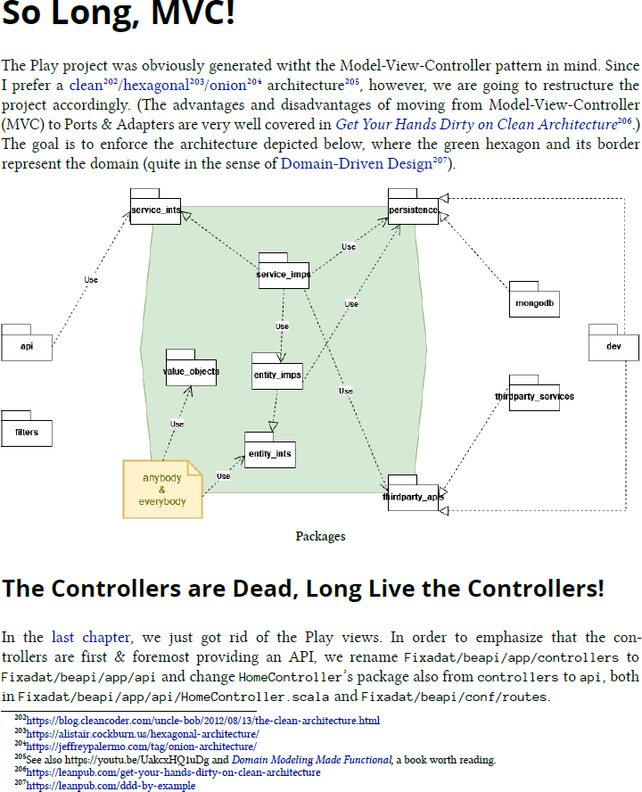



## 🤔

It is not false modesty when I acknowledge that [Dave Farley](https://www.davefarley.net/) is the better software engineer than I am. Yet I had a hard time deciding whether to rate [Modern Software Engineering](https://www.pearson.com/en-us/subject-catalog/p/modern-software-engineering-doing-what-works-to-build-better-software-faster/P200000009466/9780137314911) as [👍 or 👎](/stapel).

I agree with pretty much all the guidelines, practices, etc. that he promotes (the Ports & Adapters pattern, for instance, see the extract from [my work in progress book](https://leanpub.com/DevWebApps) below). Heck, I am even willing to give TDD another try; at the very least I fully agree that designing for testability is critical and has the pleasant side effect of leading to better designs. And while [his previous book](https://leanpub.com/cd-pipelines) is straightforward and an obvious 👍👍, it seems like he sometimes got carried away while thinking & writing about software engineering. For example, after having (re-)discovered a classical hammer (namely the scientific method), he interprets too much as nails: automated testing is great and scientific experiments are great, but testing is not the same as conducting experiments. And especially for someone who uses physics (a science) and other engineering disciplines as illustrations, I wish he would have been clearer about his understanding of computer science vs. [software development vs. software engineering](https://io.squeng.com/2021/12/05/working-software/).

To make a long story short: work through the book and be self-confident enough to filter the few 👎 parts while adopting the many 👍 parts in order to build better softare faster. Then it will have been worth the author's time to have written the book and your time to have read it.

