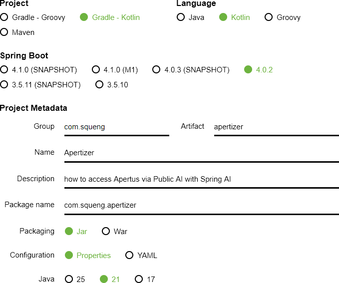
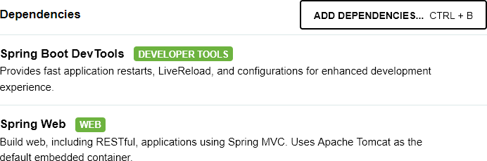
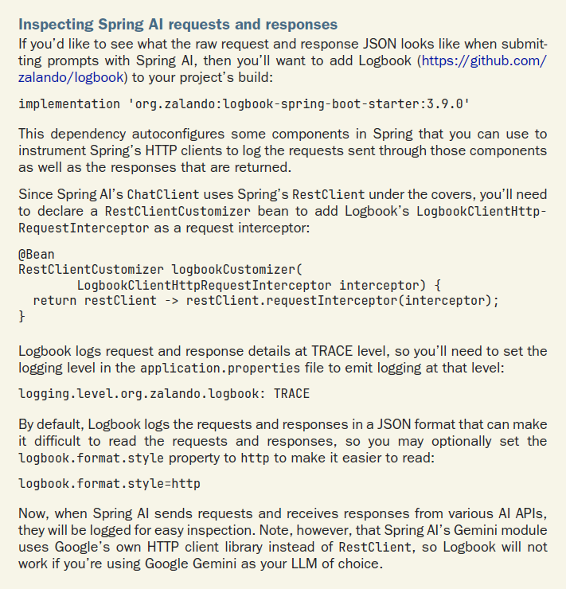



## Spring

[Public AI](https://publicai.co/) and [Spring AI](https://spring.io/projects/spring-ai) make it easy to access [Apertus](https://www.swiss-ai.org/apertus).

To follow along, you need to be familiar with Spring (Boot) in general and Spring AI in particular. If that is not the case yet, check out [Spring in Action](https://www.manning.com/books/spring-in-action-sixth-edition) (or [Spring Boot 3](https://dpunkt.de/produkt/spring-boot-3/)) and [Spring AI in Action](https://www.manning.com/books/spring-ai-in-action), respectively. But if you already know how to [create projects](#create-project) [securely](#security-as-a-forethought) and [cleanly](#create-subproject), you can skip ahead to [the AI section](#configure-spring-ai).

### Create Project

There are various ways to create a Spring Boot project. My preferred way is to use the [Spring Initializr](https://start.spring.io/):



(At the time of this writing, Kotlin does not support Java 25 and Spring AI does not support Spring Boot 4 yet, which is why Java 21 and Spring Boot 3 are selected instead.)

Even though Spring AI does not explicitly support Apertus and/or Public AI, we do not have to extend Spring's [AI Model API](https://docs.spring.io/spring-ai/reference/api/index.html#_ai_model_api) as [Wells explains in the *OpenAI compatibility* box on page 13](https://www.manning.com/books/spring-ai-in-action):

> *"Although most AI service providers have their own proprietary APIs, many offer OpenAI-compatible APIs either as their own API or as an alternative to their API. AI service providers such as Groq (https://groq.com/) and Google Gemini, tools such as vLLM (https://docs.vllm.ai/) and LiteLLM (https://www.litellm.ai/), and even Ollama offer APIs that are mostly compatible with OpenAI’s API. You can use Spring AI’s OpenAI starter to integrate with these APIs in the same way you would with OpenAI itself."*



Before Java 21, I would have included Spring Reactive Web instead of Spring Web. But now that both Java and Spring support [Virtual Threads](https://dev.java/learn/new-features/virtual-threads/) and since [Spring's asynchronous model](https://docs.spring.io/spring-framework/reference/web-reactive.html) based on [Project Reactor](https://projectreactor.io/) was never pleasant to work with (unlike [Play's asynchronous model](https://www.playframework.com/documentation/latest/ScalaAsync) based on [Scala Futures](https://docs.scala-lang.org/overviews/core/futures.html)), I am more than happy to switch back to Spring Web, but Virtual Threads must be enabled explicitly by adding the following line to `src/main/resources/application.properties`:

```
spring.threads.virtual.enabled=true
```

### Create Subproject

In order to protect the business logic / domain from the harsh world around it (the Web framework, the DBMS, etc.), I am applying the [Ports & Adapters](https://alistaircockburn.company.site/Epub-Hexagonal-Architecture-Explained-Updated-1st-ed-p751233517) pattern. I could do so within the main project, but I prefer to take advantage of Gradle's support for [multi-project builds](https://docs.gradle.org/current/userguide/multi_project_builds.html) so that Gradle can help enforcing the boundary.

Furthermore, I want to implement the business logic / domain in Scala, which Gradle supports through its [Scala plugin](https://docs.gradle.org/current/userguide/scala_plugin.html).

Prepare the folders:

- within the project folder, alongside the existing `src` folder, create a folder `hexagon`
- within folder `hexagon`, create another `src` folder 
- within folder `hexagon/src`, create folders `main` and `test`
- within folder `hexagon/src/main`, create folders `resources` and `scala`
- within folder `hexagon/src/test`, create folder `scala`

Prepare the configuration:

- within the existing `build.gradle.kts` file, add the subproject as well as the [Scala library](https://mvnrepository.com/artifact/org.scala-lang/scala3-library) as dependencies:

```
extra["scalaVersion"] = "3.3.7"
extra["springAiVersion"] = "1.1.2"

dependencies {
    implementation(project(":hexagon"))
    implementation("org.scala-lang:scala3-library_3:${property("scalaVersion")}")

    implementation("org.springframework.boot:spring-boot-starter-actuator")
```

- within the existing `settings.gradle.kts` file, add the subproject as well:

```
rootProject.name = "apertus"
include("hexagon")
```

- within folder `hexagon`, create another file `build.gradle.kts` with the following content:

```
plugins
{
    id("scala")
}

repositories {
    mavenCentral()
}

scala {
    scalaVersion = "3.3.7"
}
```

### Security as a Forethought

### Actuator

### Configure Spring AI

The switch from Open AI to Public AI with one of the two Apertus models is made by adding the following lines to `src/main/resources/application.properties`:

```
spring.ai.openai.api-key=${PUBLIC_AI_API_KEY}
# spring.ai.openai.api-key for DEV is set in $HOME\.config\spring-boot-devtools.properties
spring.ai.openai.base-url=https://api.publicai.co
# spring.ai.openai.chat.base-url=https://api.publicai.co
spring.ai.openai.chat.options.model=swiss-ai/apertus-8b-instruct
# spring.ai.openai.chat.options.model=swiss-ai/apertus-70b-instruct
```

The [production API key]((https://platform.publicai.co/settings/api-keys)) will have to be configured through an environment variable. But since the [developer tools](https://docs.spring.io/spring-boot/reference/using/devtools.html#using.devtools.globalsettings) have been included above, the [development API key]((https://platform.publicai.co/settings/api-keys)) can be added to [$HOME/.config/spring-boot.spring-boot-devtools.properties](https://docs.spring.io/spring-boot/reference/using/devtools.html#using.devtools.globalsettings) and is picked up in [the usual order](https://docs.spring.io/spring-boot/reference/features/external-config.html).

As trivial as it may seem now, [Wells' *Inspecting Spring AI requests and responses* box on page 41](https://www.manning.com/books/spring-ai-in-action) helped me figure out that prefixing the model with `swiss-ai/` is the way to go (whereas overwriting the `spring.ai.model.chat` with `swiss-ai` is not as that would cause Spring AI to look for a [ChatModel](https://docs.spring.io/spring-ai/reference/api/chatmodel.html) implementation that does not [exist](https://docs.spring.io/spring-ai/reference/api/chat/comparison.html)).


