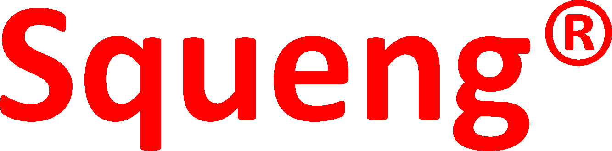

---

- [Blog](https://io.squeng.com/)
- [Über …](index.md)
- [Ingenieure](ingenieure.md)
- [Technologien](technologien.md)
- [Impressum](impressum.md)
- [Rechtliche Hinweise](rechtliche_hinweise.md)

---

## Technologien

Bevorzugter [Technologie-Stapel](https://stackshare.io/):

- Programmierspachen: [Scala](https://www.scala-lang.org/) und [TypeScript](https://www.typescriptlang.org/)
- Web-Gerüst und -Bibliothek: [Play](https://www.playframework.com/) und [React](https://reactjs.org/)
- Plattform: [Java](https://dev.java/)
- Datenbankverwaltungssystem: [MongoDB](https://www.mongodb.com/)
